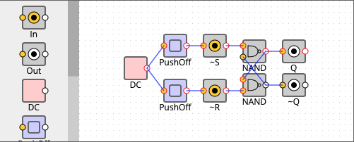
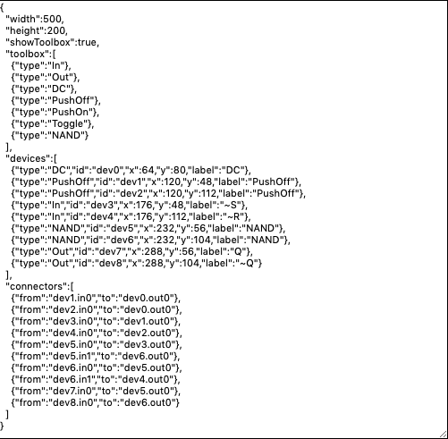

Note: ce petit quide vous propose de partir de la version du simulateur enrichie
par l'équipe enseignante de l'Université de Bordeaux. Toutefois, vous pouvez partir
du [simulateur d'origine](https://kazuhikoarase.github.io/simcirjs/) et suivre les indications
dans la rubrique "Reuse your circuit".

Contact: [raymond.namyst@u-bordeaux.fr](mailto:raymond.namyst@u-bordeaux.fr)

# Installation

Pour enrichir la base de circuit existante du simulateur, vous devez d'abord récupérer le contenu
complet du simulateur (essentiellement des fichiers javascript).
L'archive zip peut être téléchargée [ici](Simulateur_Circuits.zip)

Une fois l'archive décompressée, le répertoire `Simulateur_Circuits/` contient tous les fichiers
nécessaires au fonctionnement du simulateur en local sur votre machine.
Double-cliquez sur le fichier `blank-teacher.html` : cela devrait lancer le simulateur dans votre navigateur !

# Ajout d'un circuit

Pour pouvoir ajouter votre circuit préféré dans la base des circuits réutilisables,
il faut spécifier ses entrées et ses sorties à l'aide de boîtes **in** et **out**.

Dans l'exemple ci-dessous, on a utilisé un générateur (DC) ainsi que deux interrupteurs
(PushOff) pour tester un petit circuit, mais ces éléments ne font pas partie de notre circuit
(remarquez l'insertion des boîtes **in** entre les interrupteurs et notre circuit).

Parfait. Maintenant, un Ctrl-Click (ou Command-Click sur Mac) sur le circuit vous affiche sa description textuelle :

Copiez-collez ce code et insérez-le dans le fichier `simcir-ub-added-library.js` :

    simcir.registerDevice('MonCircuit',
    // collez la description textuelle ici (attention aux accolades et parenthèses...)
    );

Ca y est ! Si vous rechargez la page `blank-teacher.html`, vous trouverez votre circuit parmi ceux proposés dans la colonne de gauche.

# Mise à disposition des élèves

Pour que les élèves puissent utiliser votre base de circuits sans pour autant récupérer l'archive complète sur leur compte, il suffit que vous placiez le répertoire `Simulateur_Circuits/` sur un serveur web.

Si vous ne souhaitez pas qu'ils aient accès à tous les circuits, regardez comment la liste sélective des circuits est proposée dans le fichier `blank.html`.

